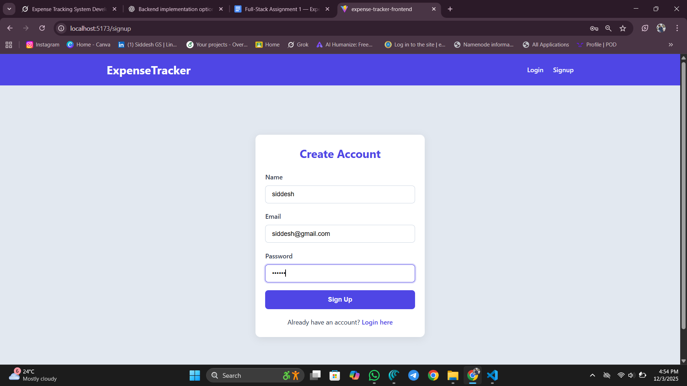
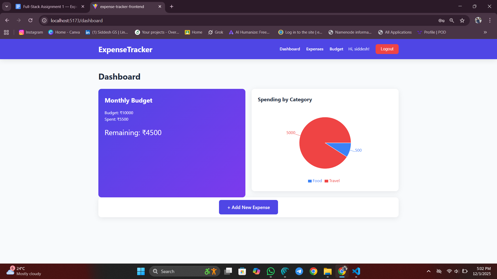
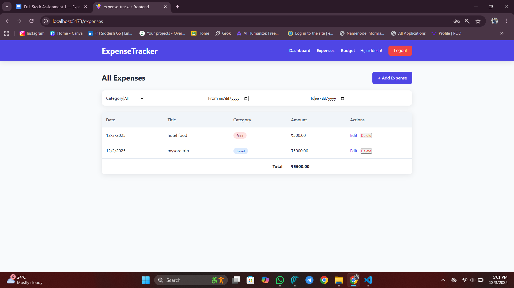
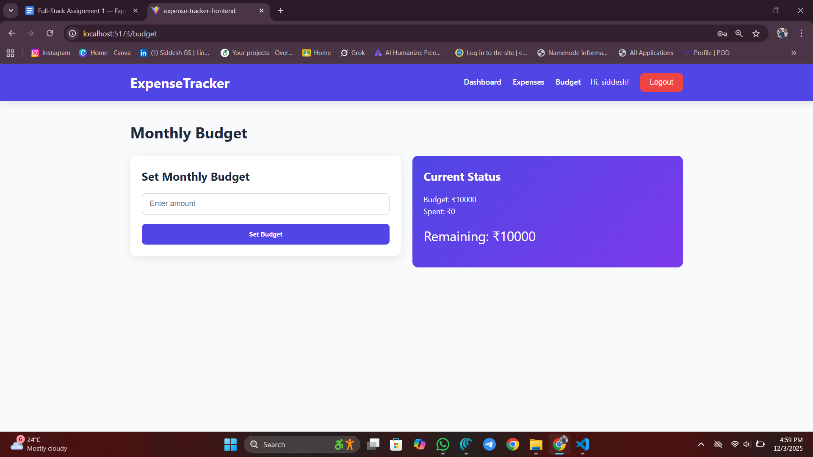

# Expense Tracker – Full Stack MERN Application

A complete expense tracking system with authentication, budget alerts, filters, and a beautiful responsive dashboard.

---

### Features
- Secure signup/login (JWT + httpOnly cookies + bcrypt)
- Add / Edit / Delete expenses
- Filter by category & date range
- Monthly budget with real-time tracking
- Red warning when budget is exceeded
- Dashboard with interactive Pie Chart (Recharts)
- Fully responsive UI 

---

### Tech Stack
- **Frontend:** React + Vite + Recharts
- **Backend:** Node.js + Express + MongoDB
- **Auth:** JWT + bcrypt

---

### Screenshots

| Login & Signup                  | Dashboard (Normal)                 |
|----------------------------------|-------------------------------------|
|  |  |

| Budget Exceeded Warning          | Add / Edit Expense                 |
|----------------------------------|-------------------------------------|
|  |  |

| Expense List + Filters           | Budget Page                        |
|----------------------------------|-------------------------------------|
|  |  |

---

### Run Locally

```bash
# Backend
cd backend
npm install
npm run dev

# Frontend 
cd frontend
npm install
npm run dev
